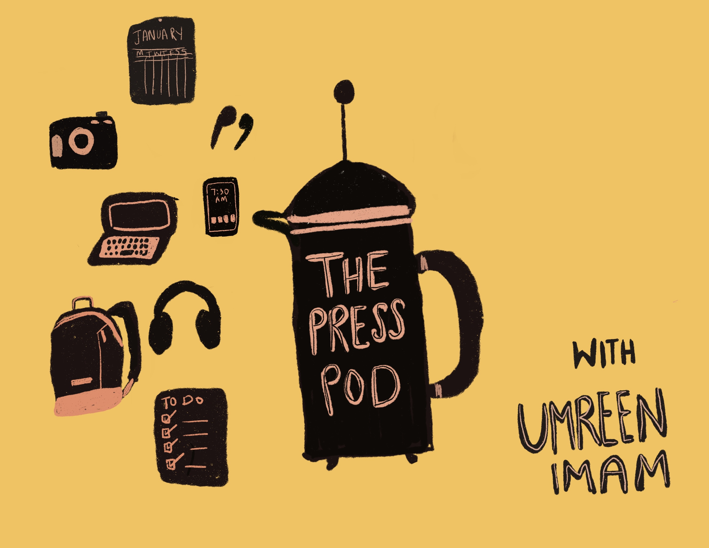

# Hi! I'm Umreen :wave:

### Allow me to introduce myself: 
##### I am a Web Developer, and I'm very passionate and dedicated to my work. I enjoy all aspects of designing an application, and get very excited to collaborate and discuss ideas with others to build and deliver unique products and apps! I :heart: JavaScript & Python, discovering new music to bop my head to, technology, and all things coffee :coffee:

#### 😄 Pronouns: she/her

## Currently...

#### 🔭 I’m working on: 
  * Getting a Master's degree in Data Analytics
  * Building a weather application to work on my frontend skills
  * Creating a Skillshare lesson on Web Development

#### 🌱 I’m currently learning: 
  * How to perform data analysis using Python and packages such as Pandas, Numpy, Matplotlib, and so much more
  * Object oriented programming with Python (needing a refresher)
  * How to use Notion to its full potential to organize my life 

#### 📫 How to reach me:
  * [LinkedIn] https://www.linkedin.com/in/umreen-imam/
  * [Twitter] https://twitter.com/umreeny24
  * [Instagram] https://www.instagram.com/the_presspod/

#### ⚡ Fun fact:

  
  
  * I have a podcast! I'm the host and creator of, The Press Pod. A show where I provide my insights and experiences with productivity, technology, and career changes. Oh and most importantly, coffee! You can listen to it on your favorite podcast streaming service or here: https://thepresspod.transistor.fm
  * I also LOVE anything everything productivity tools, bullet journaling, & backpacks. Strange combo or the combo that's missing from your life? :open_mouth:

#### :books: Books I'm currently reading: 
  * Star Wars - The High Republic: The Light of the Jedi by Charles Soule
  * The Motivation Myth by Jeff Haden
  
#### :books: Books I think EVERYONE should read: 
   * Show Your Work! by Austin Kleon  
   * Anxious People by Fredrik Backman
